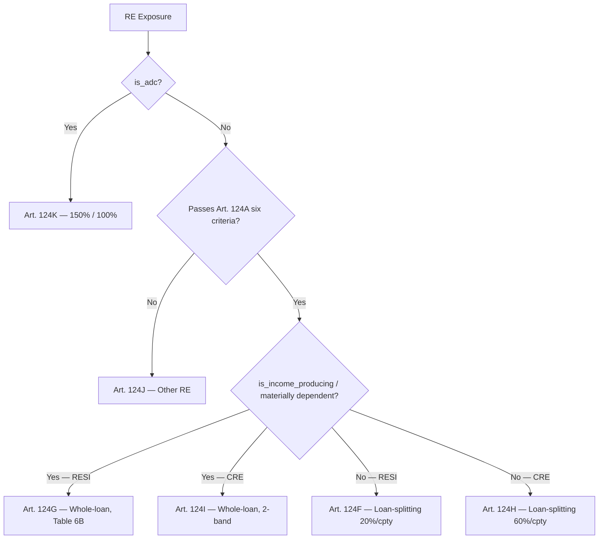

# Real Estate Exposures

**Real estate exposures** are credit exposures secured by mortgages on residential or
commercial immovable property. Under Basel 3.1 (PRA PS1/26 Art. 124–124L), real estate
becomes a **standalone exposure class** (Art. 112 Table A2 priority 7) with dedicated
loan-splitting and LTV-banded risk-weight tables, replacing the CRR Art. 125/126 regime.

## Definition

A real estate exposure is any credit exposure secured by a charge over residential or
commercial immovable property. Under Basel 3.1, the framework distinguishes three
treatment buckets via the [Art. 124 routing rule](#routing-art-1241-3):

| Bucket | Article | Treatment |
|--------|---------|-----------|
| **Regulatory RE** — passes Art. 124A six-criterion gate | Art. 124(1) | Loan-splitting (Art. 124F/H) or income-producing tables (Art. 124G/I) |
| **Other RE** — fails Art. 124A but is not ADC | Art. 124(2) | Art. 124J fallback (150% income-dependent / counterparty RW otherwise) |
| **ADC** — acquisition / development / construction | Art. 124(3) | Art. 124K (150% standard, 100% qualifying residential) |

!!! warning "RE Class Distinct from RETAIL_MORTGAGE"
    Residential-mortgage-secured exposures to **retail counterparties** that meet the
    Art. 123 retail criteria are routed through `RETAIL_MORTGAGE` (CRR Art. 125: 35%
    on the ≤80% LTV portion, 75% above). Real-estate-secured exposures to **non-retail
    counterparties** (corporates, institutions, large landlords, SMEs above the retail
    threshold) enter the SA real-estate loan-splitter via `RESIDENTIAL_MORTGAGE` /
    `COMMERCIAL_MORTGAGE` instead. See [Retail Exposures](retail.md#retail-mortgage)
    for the retail-class boundary.

## Routing (Art. 124(1)–(3))



The **ADC check is evaluated first** (Art. 124(3)) — Art. 124A(1) opens *"A real estate
exposure is a regulatory real estate exposure if it is **not an ADC exposure** and all
the following requirements are met"*. ADC therefore never enters the Art. 124F–124J
channel regardless of LTV, occupancy, or qualifying-criteria status.

> **Details:** See [Real Estate — Framework Scope (Art. 124)](../../specifications/basel31/sa-risk-weights.md#real-estate--framework-scope-art-124) for the full routing decision tree, mixed-use Art. 124(4) split, and CRR comparison.

## The Six Qualifying Criteria — Art. 124A(1)

A real estate exposure is **regulatory RE** (and so eligible for the preferential
Art. 124F–124I tables) only if it satisfies **all six** of the following. Failing
any one drops the exposure to Art. 124J.

| Criterion | Requirement | Reference |
|-----------|-------------|-----------|
| **(a) Property condition** | Property is not held for development/construction, OR development is complete, OR it is a self-build exposure | Art. 124A(1)(a)(i)–(iii) |
| **(b) Legal certainty** | Charge is enforceable in all relevant jurisdictions AND collateral can be realised within a reasonable period after default | Art. 124A(1)(b) |
| **(c) Charge conditions** | One of the conditions in Art. 124A(2) is met (perfected first-rank charge, or stacked junior charge with full transparency) | Art. 124A(1)(c) |
| **(d) Valuation** | Property value obtained per Art. 124D (qualifying valuation, independent, at or below market) | Art. 124A(1)(d) |
| **(e) Borrower independence** | Property value does **not** materially depend on borrower performance | Art. 124A(1)(e) |
| **(f) Insurance monitoring** | Institution has procedures to monitor adequate property insurance against damage | Art. 124A(1)(f) |

The calculator consumes the firm's pre-evaluated **`is_qualifying_re`** flag — it does
not re-derive the six tests in-engine.

> **Details:** See [Real Estate — Qualifying Criteria (Art. 124A)](../../specifications/basel31/sa-risk-weights.md#real-estate--qualifying-criteria-art-124a) for the full criterion-by-criterion breakdown, the self-build carve-out under (a)(iii), and the Art. 124A(2) charge-condition list.

## Hard-Test vs Soft-Test: Material Dependency (Art. 124E)

Within regulatory RE, Art. 124E classifies the exposure between two treatment tracks:

| Track | Test result | Track |
|-------|-------------|-------|
| **Hard test** (loan-splitting) | Property cash flows are **NOT** a material source of repayment | Art. 124F (RESI) / Art. 124H (CRE) |
| **Soft test** (whole-loan, LTV-banded) | Property cash flows **ARE** a material source of repayment | Art. 124G (RESI) / Art. 124I (CRE) |

**Residential default rule (Art. 124E(1)):** A residential RE exposure is **presumed
not materially dependent** on the property's cash flows. The presumption flips to
"materially dependent" only where the borrower has **more than three financed
residential properties**, in which case all subsequent properties enter the
income-producing track.

**Commercial own-use test (Art. 124E(6)):** A commercial RE exposure is **not
materially dependent** if the property is used **predominantly for the borrower's
own business purpose**. Owner-occupied office, factory, or warehouse loans take the
loan-splitting track; let-out CRE (rent-financed) takes the income-producing track.

The calculator consumes **`is_income_producing`** to route between the two tracks.

> **Details:** See [Material Dependency Classification (Art. 124E)](../../specifications/basel31/sa-risk-weights.md#real-estate--material-dependency-classification-art-124e) for the full default rule, the three-property limit, the own-use test, and re-assessment triggers (Art. 124E(5)/(7)).

## LTV Definition — Art. 124C

The regulatory LTV used for all loan-splitting thresholds and band lookups is:

```
LTV = loan_amount / property_value
```

**Numerator (Art. 124C(2)–(3)):**

- Outstanding loan balance + undrawn committed amount of the mortgage loan
- **Plus** all loans secured by charges ranking **ahead of** or **pari passu**
  with the institution's charge (Art. 124C(3) — prior charges stacking)
- **Excluding** credit risk adjustments, own-funds reductions, and funded/unfunded
  credit protection (single exception: pledged-deposit on-balance-sheet netting may
  be deducted)
- Where ranking information is incomplete, the institution **must** treat other
  charges as pari passu — a conservative assumption that increases LTV

**Denominator (Art. 124C(4)):** Property value per Art. 124D qualifying valuation,
with revaluation triggers at >10% market decline and a GBP 2.6m / 5%-of-own-funds
threshold for transitional pre-2027 exposures.

Two input fields drive the calculator's LTV logic:

| Field | Description |
|-------|-------------|
| `property_ltv` | Total stacked LTV including all Art. 124C(2)–(3) components — used for risk-weight band lookup |
| `prior_charge_ltv` | LTV contribution of prior/pari passu charges only — used to reduce the 55% loan-splitting threshold under Art. 124F(2) / 124H(2) and to trigger the 1.25× junior-charge multiplier under Art. 124G(2) |

> **Details:** See [Real Estate — LTV Definition (Art. 124C)](../../specifications/basel31/sa-risk-weights.md#real-estate--ltv-definition-art-124c) for the full numerator components, prior-charges worked example, and Art. 124D valuation rules including the self-build floor.

## Risk Weights — Residential RE (Art. 124F–124G)

### Loan-Splitting — Owner-Occupied / Non-Income-Producing (Art. 124F)

Exposure is split into a secured portion (up to 55% of property value) and a residual:

| Portion | Risk Weight | Reference |
|---------|-------------|-----------|
| Secured (up to 55% of property value) | **20%** | Art. 124F(1) |
| Residual (above 55%) | **Counterparty RW** per Art. 124L | Art. 124F |

```
secured_share = min(1.0, 0.55 / LTV)
RW_blended = 0.20 × secured_share + counterparty_RW × (1.0 - secured_share)
```

**Junior charges (Art. 124F(2)):** Where prior-ranking charges held by other lenders
exist, the 55% threshold is **reduced by the prior_charge_ltv** before computing
`secured_share`. This shrinks the 20%-weighted portion.

### Income-Producing — Whole-Loan, Table 6B (Art. 124G)

Materially dependent on property cash flows (e.g. buy-to-let, multi-unit rental
to a single landlord). Single risk weight on the whole exposure:

| LTV Band | Risk Weight |
|----------|-------------|
| ≤ 50% | 30% |
| 50–60% | 35% |
| 60–70% | 40% |
| 70–80% | 50% |
| 80–90% | 60% |
| 90–100% | 75% |
| > 100% | 105% |

**Junior charge multiplier (Art. 124G(2)):** Whole-loan RW × **1.25** for LTV > 50%
where prior-ranking charges held by other lenders exist. The multiplied RW is
**not capped** at the table maximum of 105% — e.g. a 105% × 1.25 = 131.25% weight
is the correct outcome at LTV > 100% with junior charges.

## Risk Weights — Commercial RE (Art. 124H–124I)

### Loan-Splitting — Owner-Occupied (Art. 124H(1))

Borrower predominantly uses the property for its own business (Art. 124E(6)):

| Portion | Risk Weight | Reference |
|---------|-------------|-----------|
| Secured (up to **55%** of property value) | **60%** | Art. 124H(1)(a) |
| Unsecured (above 55%) | **Counterparty RW** per Art. 124L | Art. 124H(1)(b) |

!!! warning "55% threshold, not 60%"
    The loan-splitting threshold under Art. 124H(1)(a) is **55% of property value**
    (the same threshold as residential Art. 124F). The **60%** is the **risk weight**
    on the secured portion, not the LTV band.

### Income-Producing — Whole-Loan, 2-Band (Art. 124I)

Materially dependent on property cash flows (e.g. multi-tenant let CRE, hotel
financed by room revenue):

| LTV | Risk Weight |
|-----|-------------|
| ≤ 80% | **100%** |
| > 80% | **110%** |

!!! info "PRA Deviation from BCBS"
    BCBS CRE20.86 uses a 3-band table (≤60%: 70%, 60–80%: 90%, >80%: 110%).
    The PRA simplifies to 2 bands with higher weights for the lower LTV tiers.

**Junior charge treatment (Art. 124I(3)):** Where prior-ranking charges held by other
lenders exist, the income-producing CRE table is replaced by **absolute** weights
(not a multiplier on Art. 124I(1)/(2)):

| LTV Band | RW with junior charges |
|----------|------------------------|
| ≤ 60% | 100% |
| > 60% and ≤ 80% | 125% |
| > 80% | 137.5% |

### Large Corporate CRE — Art. 124H(3)

For **non-natural-person, non-SME** borrowers with non-cash-flow-dependent CRE,
a third path applies on top of loan-splitting:

```
RW = max(60%, min(counterparty_RW, income_producing_RW))
```

## Counterparty Risk Weights — Art. 124L

The unsecured residual under loan-splitting (Art. 124F / 124H) is weighted using:

| Counterparty Type | Counterparty RW |
|-------------------|------------------|
| Natural person (non-SME) | 75% |
| Retail-qualifying SME | 75% |
| Other SME (unrated) | 85% |
| Social housing / cooperative | max(75%, unsecured RW) |
| Other (corporate, institution) | Standard unsecured counterparty RW |

> **Details:** See [Real Estate — Residential](../../specifications/basel31/sa-risk-weights.md#real-estate--residential-art-124f124g) and [Real Estate — Commercial](../../specifications/basel31/sa-risk-weights.md#real-estate--commercial-art-124h124i) for the full risk-weight derivation, including worked examples and the Art. 124L counterparty table.

## ADC Exposures — Art. 124K

**ADC (Acquisition, Development, and Construction)** exposures are loans to
**corporates or SPEs** (not natural persons) financing land acquisition for
development/construction, or financing the development/construction itself:

| Scenario | Risk Weight | Reference |
|----------|-------------|-----------|
| Standard ADC | **150%** | Art. 124K(1) |
| Qualifying residential ADC | **100%** | Art. 124K(2) |

The 100% concession is **residential-only** and requires **both**:

- **(a) Prudent underwriting** — including for any RE used as security
- **(b) At least one of:**
    - **(i) Pre-sales/pre-leases:** Legally binding contracts where the buyer/tenant
      has made a substantial cash deposit subject to forfeiture, amounting to a
      significant portion of total contracts, OR
    - **(ii) Borrower equity at risk:** Substantial equity contribution

!!! info "Two ADC input flags"
    The calculator uses two boolean inputs: **`is_adc`** (routes to Art. 124K) and
    **`is_presold`** (asserts Art. 124K(2) qualifying conditions are met). The PRA
    does not define quantitative thresholds for "substantial" or "significant
    portion" — these are firm-level judgements subject to supervisory review.

> **Details:** See [Real Estate — ADC Exposures (Art. 124K)](../../specifications/basel31/sa-risk-weights.md#real-estate--adc-exposures-art-124k) for the full qualifying conditions, CRR comparison (no Art. 124K under CRR; Art. 128 high-risk omitted by SI 2021/1078), and key scenarios.

## Other RE — Art. 124J (the failing-Art. 124A bucket)

Where any Art. 124A criterion fails (and the exposure is not ADC):

| Sub-bucket | RW | Reference |
|------------|-----|-----------|
| Income-dependent (any property type) | **150%** | Art. 124J(1) |
| Residential, not income-dependent | Counterparty RW per Art. 124L | Art. 124J(2) |
| Commercial, not income-dependent | max(60%, counterparty RW) | Art. 124J(3) |

The `is_qualifying_re` input flag drives the Art. 124J vs Art. 124F–124I split.
When `False`, the exposure is routed to Art. 124J **before** the standard
hard-test/soft-test branching.

## Mixed-Use Loans — Art. 124(4)

A **mixed real estate exposure** is a single exposure secured by both residential and
commercial property (e.g., a mixed-use building with shops on the ground floor and
flats above). Art. 124(4) requires **proportional splitting** by collateral value:

| Both parts qualify under Art. 124A | Either part fails Art. 124A |
|------------------------------------|------------------------------|
| RESI portion → Art. 124F/G; CRE portion → Art. 124H/I | **Both** parts → Art. 124J (all-or-nothing gate) |

**Worked example:** GBP 2,000,000 loan secured by mixed-use property valued at
GBP 2,500,000 (RESI 60%, CRE 40%). LTV = 80% on the aggregate. Both parts qualify:

| Notional component | EAD | Property value | LTV | Treatment |
|--------------------|-----|---------------|-----|-----------|
| RESI 60% | 1,200,000 | 1,500,000 | 80% | Art. 124F: 20% on first 55% × 1,500,000 = 825,000; residual 375,000 at counterparty RW |
| CRE 40% | 800,000 | 1,000,000 | 80% | Art. 124H(1): 60% on first 55% × 1,000,000 = 550,000; residual 250,000 at counterparty RW |

!!! warning "Mixed-Use Schema Gap (D3.59) — Loader-Boundary Workaround"
    The current input schema exposes a single `property_value` and `property_type` per
    exposure row, with no native mechanism to declare a mixed-property exposure. The
    Art. 124(4) proportional split is therefore **not applied automatically** — the
    calculator routes each row exclusively through either the RESI (Art. 124F–124G)
    or CRE (Art. 124H–124I) chain based on the single `property_type` flag.

    **Workaround:** Pre-split the exposure into two input rows at the loader boundary —
    one with `property_type = "residential"` and `property_value` = V_RESI, one with
    `property_type = "commercial"` and `property_value` = V_CRE — each with
    `EAD = total_EAD × (V_part / V_total)` and `is_qualifying_re` reflecting that
    part's own Art. 124A status. This matches the regulation's outcome but places the
    split-logic obligation on the firm. See D3.59 in `DOCS_IMPLEMENTATION_PLAN.md`.

> **Details:** See [Mixed Real Estate Split (Art. 124(4))](../../specifications/basel31/sa-risk-weights.md#mixed-real-estate-split-art-1244) for the full all-or-nothing gate, worked example, and CRR comparison.

## Calculation Examples

### Example 1 — Owner-Occupied House (Loan-Splitting, Art. 124F)

**Exposure:**

- £250,000 mortgage to an individual borrower
- Property value: £350,000 → LTV = 71.4%
- Owner-occupied (not income-producing)
- First charge, no prior charges (`prior_charge_ltv = 0`)
- Counterparty RW (Art. 124L): 75% (natural person)

**Calculation:**

```
secured_share = min(1.0, 0.55 / 0.714) = 0.770
RW = 20% × 0.770 + 75% × (1.0 - 0.770) = 15.4% + 17.25% = 32.65%
RWA = 250,000 × 32.65% = 81,625
```

### Example 2 — Buy-to-Let (Income-Producing, Art. 124G)

**Exposure:**

- £400,000 mortgage to a portfolio landlord with 5 financed BTL properties
  (Art. 124E(1) three-property limit breached → income-producing track)
- Property value: £500,000 → LTV = 80%
- Materially dependent on rental cash flows

**Calculation:**

```
LTV 70–80% band → RW = 50% (Table 6B)
RWA = 400,000 × 50% = 200,000
```

### Example 3 — Owner-Occupied Office (CRE Loan-Splitting, Art. 124H(1))

**Exposure:**

- £2,000,000 loan to an SME (turnover £30m → Art. 124L "other SME" → counterparty RW 85%)
- Office property used for borrower's own business; value £3,000,000 → LTV = 66.7%
- First charge

**Calculation:**

```
secured_share = min(1.0, 0.55 / 0.667) = 0.825
RW = 60% × 0.825 + 85% × (1.0 - 0.825) = 49.5% + 14.875% = 64.375%
RWA = 2,000,000 × 64.375% = 1,287,500
```

### Example 4 — Income-Producing CRE with Junior Charge (Art. 124I(3))

**Exposure:**

- £5,000,000 loan secured by a multi-tenant let office; property value £6,500,000
- LTV = 76.9%
- Senior lender holds a £1,500,000 prior charge (`prior_charge_ltv = 23.1%`)

**Calculation:**

```
LTV > 60% and ≤ 80% with junior charge → Art. 124I(3)(b) absolute weight = 125%
RWA = 5,000,000 × 125% = 6,250,000
```

### Example 5 — Qualifying Residential ADC (Art. 124K(2))

**Exposure:**

- £10,000,000 development loan to an SPE building 50 residential units
- 60% pre-sold under legally binding contracts with substantial forfeitable deposits
- Prudent underwriting confirmed by credit committee

**Calculation:**

```
is_adc = True, is_presold = True → Art. 124K(2) qualifying residential ADC
RW = 100% (vs 150% for non-qualifying)
RWA = 10,000,000 × 100% = 10,000,000
```

## CRR vs Basel 3.1 — Key Differences

| Aspect | CRR (until 31 Dec 2026) | Basel 3.1 (from 1 Jan 2027) |
|--------|-------------------------|------------------------------|
| Framework structure | Art. 125 (residential) + Art. 126 (commercial) | Art. 124–124L unified RE class |
| Residential RW (retail) | 35% on ≤80% LTV portion, 75% above (Art. 125) | LTV bands 20%–105% per Art. 124F/G |
| Commercial RW | 50% if Art. 126(2) conditions met, else counterparty RW | Loan-splitting 60%/cpty (Art. 124H) or 100/110% (Art. 124I) |
| Qualifying-criteria gate | Art. 125(2) / 126(2) conditions | Art. 124A six-criterion gate |
| ADC | No standalone class (Art. 128 high-risk omitted by SI 2021/1078) | Art. 124K — 150% standard / 100% qualifying |
| Income-producing distinction | Implicit in Art. 126 own-use test | Explicit Art. 124E material-dependency test |
| Mixed-use split | Implicit (predominant security) | Explicit Art. 124(4) proportional split |
| Output floor | N/A | RE exposures contribute to 72.5% SA-equivalent floor |

> **Details:** See [Key Differences — Real Estate](../../framework-comparison/key-differences.md#residential-real-estate) for the full CRR vs Basel 3.1 comparison and transitional treatment.

## Underwriting Standards — Art. 124B

Article 124B is a **governance precondition** for originating real estate exposures
applicable to **all** RE — regulatory RE, other RE, and ADC. Institutions must operate
an underwriting policy that, at a minimum, requires assessment of the borrower's
ability to repay.

This is **not a calculator input** — compliance is evidenced by underwriting policy
documentation, credit-committee approval records, and PRA supervisory review (CRD
Art. 79, SS31/15 ICAAP). A breach does not automatically reclassify exposures into
Art. 124J; supervisory enforcement is the remedy.

> **Details:** See [Real Estate — Underwriting Standards (Art. 124B)](../../specifications/basel31/sa-risk-weights.md#real-estate--underwriting-standards-art-124b) for the full firm-governance scope and relationship to other Art. 124-series provisions.

## Input Schema Summary

| Field | Type | Description |
|-------|------|-------------|
| `is_adc` | bool | Routes to Art. 124K; bypasses LTV-band logic |
| `is_presold` | bool | Together with `is_adc=True`, applies Art. 124K(2) qualifying-residential 100% RW |
| `is_qualifying_re` | bool | Asserts the six Art. 124A(1) criteria are met; `False` routes to Art. 124J |
| `is_income_producing` | bool | Routes to whole-loan tables (Art. 124G/I) instead of loan-splitting (Art. 124F/H) |
| `property_type` | enum | `"residential"` or `"commercial"` — drives RESI vs CRE branching |
| `property_value` | Decimal | Art. 124D-compliant qualifying valuation (firm-supplied) |
| `property_ltv` | Float64 | Total Art. 124C(1)–(3) stacked LTV (incl. prior charges) |
| `prior_charge_ltv` | Float64 | Prior/pari-passu charge contribution to LTV (drives junior-charge logic) |
| `counterparty_type` | enum | Drives Art. 124L counterparty RW for loan-splitting residual |

## Regulatory References

| Topic | PRA PS1/26 / CRR | BCBS CRE |
|-------|------------------|----------|
| RE framework scope and routing | Art. 124(1)–(4) | CRE20.71 |
| Six qualifying criteria | Art. 124A | CRE20.71–73 |
| Underwriting standards (governance) | Art. 124B | — |
| LTV definition | Art. 124C | CRE20.74–75 |
| Valuation requirements | Art. 124D | CRE20.76 |
| Material dependency classification | Art. 124E | CRE20.77 |
| RESI loan-splitting (hard test) | Art. 124F | CRE20.81 |
| RESI income-producing (soft test) | Art. 124G, Table 6B | CRE20.83 |
| CRE loan-splitting | Art. 124H | CRE20.82 |
| CRE income-producing | Art. 124I | CRE20.86 |
| Other RE fallback | Art. 124J | CRE20.85 |
| ADC | Art. 124K | CRE20.84 |
| Counterparty RW for residual | Art. 124L | CRE20.81–82 |
| Legacy CRR residential | CRR Art. 125 (omitted from Basel 3.1) | — |
| Legacy CRR commercial | CRR Art. 126 (omitted from Basel 3.1) | — |

## Next Steps

- [Retail Mortgage](retail.md#retail-mortgage) — retail-class boundary
- [Covered Bonds](covered-bonds.md) — Art. 129 RE-backed securities
- [Standardised Approach](../methodology/standardised-approach.md)
- [SA Risk Weights specification (Basel 3.1)](../../specifications/basel31/sa-risk-weights.md)
