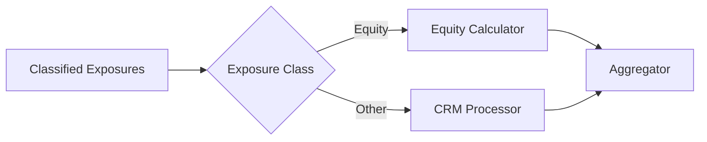

# Equity Exposures

**Equity exposures** receive dedicated risk weight treatment separate from credit risk. Under CRR, the calculator supports SA (Article 133) and IRB Simple (Article 155). Under Basel 3.1, only SA applies.

## Overview

Equity exposures are routed directly from classification to the equity calculator, bypassing CRM processing (collateral is not applied to equity holdings).



## CRR Article 133 - Standardised Approach (SA)

Under CRR, Art. 133(2) assigns a **flat 100% risk weight** to all equity exposures (except central bank sovereign equity at 0%). There is no differentiation by equity type — listed, unlisted, PE, and speculative all receive 100%.

| Equity Type | Risk Weight | Reference |
|-------------|-------------|-----------|
| Central bank / sovereign equity | 0% | Sovereign treatment |
| All other equity (listed, unlisted, PE, etc.) | 100% | Art. 133(2) flat |

Under Basel 3.1, equity that is unlisted and where the business has existed for less than five years is classified as "higher-risk" (400%, Art. 133(4)). PE/VC is only higher-risk if it meets both criteria — long-established PE holdings receive standard 250%.

!!! warning "Common Confusion: CRR vs Basel 3.1 Art. 133"
    CRR Art. 133 assigns a flat 100% to all equity. **Basel 3.1** rewrites Art. 133 with differentiated weights: 250% (standard), 400% (higher risk), 150% (subordinated debt), 100% (legislative). Do not confuse the two. See the [Equity Approach Specification](../../specifications/crr/equity-approach.md) for full details including CIU treatment and the Basel 3.1 transitional schedule.

**Calculation:**
```
RWA = EAD x Risk Weight
```

## Article 155 - IRB Simple Risk Weight Method

For firms with IRB permission, a different risk weight schedule applies:

| Equity Type | Risk Weight | Reference |
|-------------|-------------|-----------|
| Exchange-traded / Listed | 290% | Art. 155(2)(a) |
| Private equity (diversified portfolios) | 190% | Art. 155(2)(b) |
| All other equity (unlisted, speculative, CIU, other) | 370% | Art. 155(2)(c) |

!!! warning "Art. 155 has exactly three categories"
    CRR Art. 155(2) defines only the three risk weight buckets shown above. The code additionally maps `GOVERNMENT_SUPPORTED` and `CENTRAL_BANK` equity types to 190% and 0% respectively — these are implementation-specific mappings with no direct basis in Art. 155 text. Government-supported equity at 100% under SA (Art. 133) is a legislative programme treatment, not an IRB Simple category. See [D3.4 in DOCS_IMPLEMENTATION_PLAN.md](../../../DOCS_IMPLEMENTATION_PLAN.md) and the [Equity Approach Specification](../../specifications/crr/equity-approach.md#crr-irb-simple-risk-weight-method-art-155) for details.

### Diversified Portfolio Treatment

Private equity holdings in a diversified portfolio receive a reduced risk weight of **190%** (vs 370% for non-diversified). This is flagged via the `is_diversified_portfolio` attribute.

### Short-Position Netting (Art. 155(2))

Art. 155(2) permits limited netting of short equity positions against long positions
under the Simple Risk Weight Approach. The conditions are strict:

- **Same individual stock** — short cash positions and derivatives held in the
  non-trading book may offset long positions in the same individual stock.
- **Explicit hedge** — the hedging relationship must be explicit (designated and
  documented), not an incidental offset.
- **Minimum residual maturity of 1 year** — the hedge must cover the long position
  for **at least one year**.

Short positions that do not meet these criteria are treated **as if they were long
positions**, with the relevant Art. 155(2) risk weight applied to the **absolute value**
of the short position. Netting cannot reduce the gross long exposure for risk-weighting
purposes outside the explicit-hedge case.

!!! note "Netting is per-stock, not portfolio-level"
    Art. 155(2) netting is between long and short positions in the **same individual
    stock**. It is not a basket-level or sector-level offset. See the
    [CRR Equity Approach Specification](../../specifications/crr/equity-approach.md#simple-risk-weight-approach-art-1552)
    for the verbatim Art. 155(2) text.

### Internal Models Approach (Art. 155(4))

Firms with PRA permission for the IRB Internal Models Approach (IMA) for equity
calculate RWEA as **12.5 × potential loss**, where potential loss is derived from
an internal VaR model at the **99th percentile, one-tailed confidence interval**
on the difference between quarterly returns and an appropriate risk-free rate,
computed over a long-term sample period.

**Art. 155(4) IMA floor** — the IMA portfolio-level RWEA must **not be lower than
the floor** computed as the sum of:

```
Floor RWEA (Art. 155(4)) = PD/LGD RWEA (Art. 155(3)) + EL × 12.5
```

where both `PD/LGD RWEA` and `EL` are computed using the Art. 165(1) PD floors and
Art. 165(2) LGD values for equity. This is a **portfolio-level** floor that bites
when the firm's internal VaR estimate is more optimistic than the regulatory PD/LGD
output.

!!! warning "Art. 155(4) floor vs Art. 155(3) per-exposure cap"
    The Art. 155(4) IMA floor (`PD/LGD RWEA + EL × 12.5`) is a **lower bound on the
    IMA portfolio output**. It is distinct from the Art. 155(3) per-exposure cap
    (`EL × 12.5 + RWEA ≤ EAD × 12.5`), which limits the PD/LGD output of any single
    exposure to a 100% loss assumption. The two operate on different approaches
    (IMA vs PD/LGD) and at different levels (portfolio vs exposure).

See the [CRR Equity Approach Specification](../../specifications/crr/equity-approach.md#internal-models-approach-art-1554)
for the full IMA mechanics including Art. 165 PD floors and LGD values used in the
floor computation.

!!! note "CRR Only — Removed Under Basel 3.1"
    The IRB Simple Risk Weight Method (Article 155(2)), the PD/LGD Approach
    (Art. 155(3)), and the Internal Models Approach (Art. 155(4)) all apply only
    under CRR. Under **Basel 3.1 (PRA PS1/26 Art. 147A)**, the entire IRB Equity
    Approach is **abolished** — all equity exposures must use Art. 133 SA
    treatment (250% / 400%). The change is phased in via PRA Rules 4.4–4.10
    (transitional 2027–2029) for firms that held IRB permission on
    31 December 2026, after which only SA applies. See the
    [Basel 3.1 Equity Approach Specification](../../specifications/basel31/equity-approach.md)
    and the [CRR Equity Transitional Schedule](../../specifications/crr/equity-approach.md#equity-transitional-schedule-pra-rules-4110).

## Approach Determination

The equity approach depends on the regulatory framework and IRB permissions:

| Framework | IRB Permission | Equity Approach |
|-----------|----------------|-----------------|
| CRR | SA only | Article 133 (SA) |
| CRR | IRB permitted | Article 155 (IRB Simple) |
| Basel 3.1 | Any | Article 133 (SA) — IRB equity removed |

## Example

**Equity holding:** Listed shares, £2m

**SA Treatment (Article 133):**
```
RWA = £2,000,000 x 100% = £2,000,000
```

**IRB Simple Treatment (Article 155):**
```
RWA = £2,000,000 x 290% = £5,800,000
```

## Regulatory References

| Topic | Reference |
|-------|-----------|
| SA equity treatment | CRR Art. 133 |
| IRB simple risk weight | CRR Art. 155 |
| Strategic equity treatment | EBA Q&A 2023_6716 |
